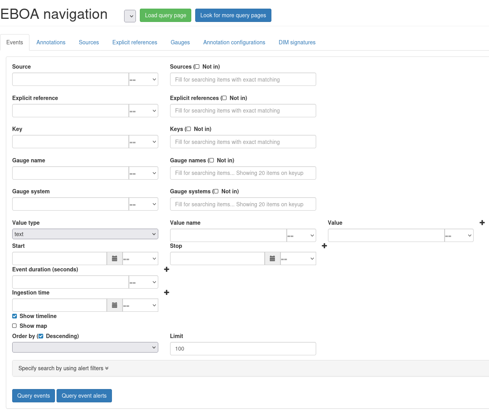
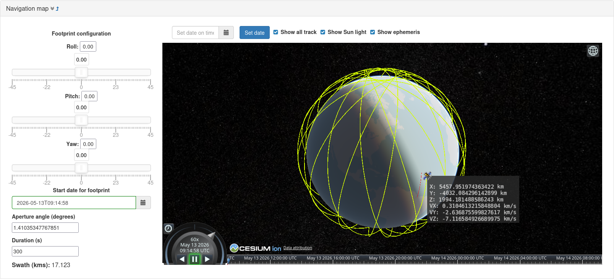
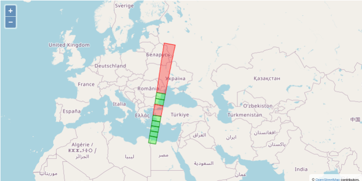
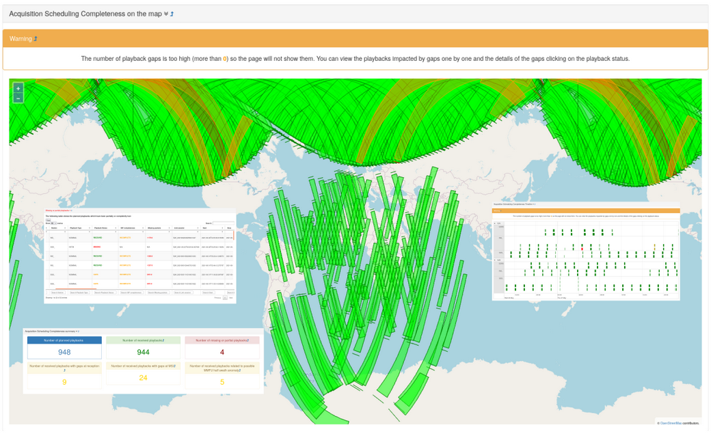
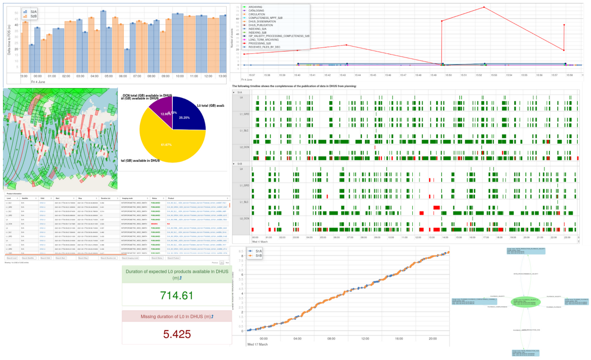
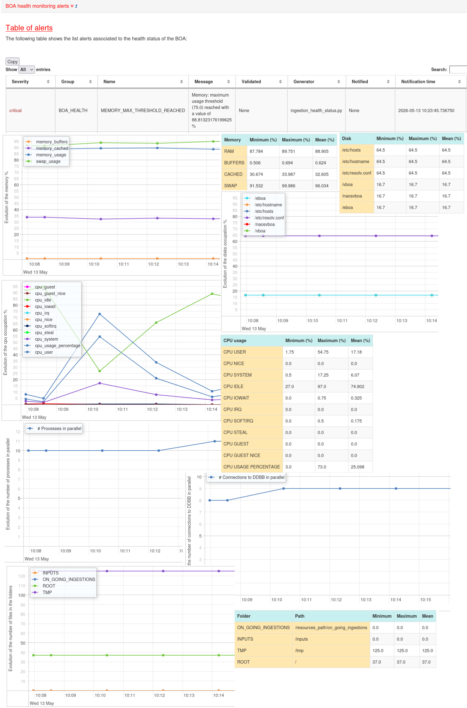
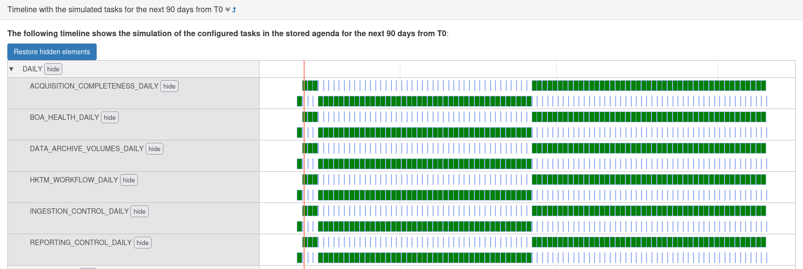
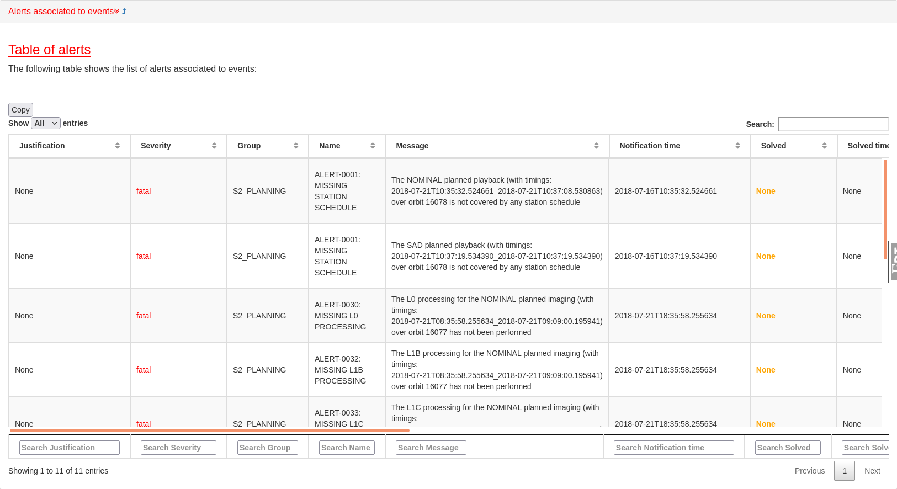
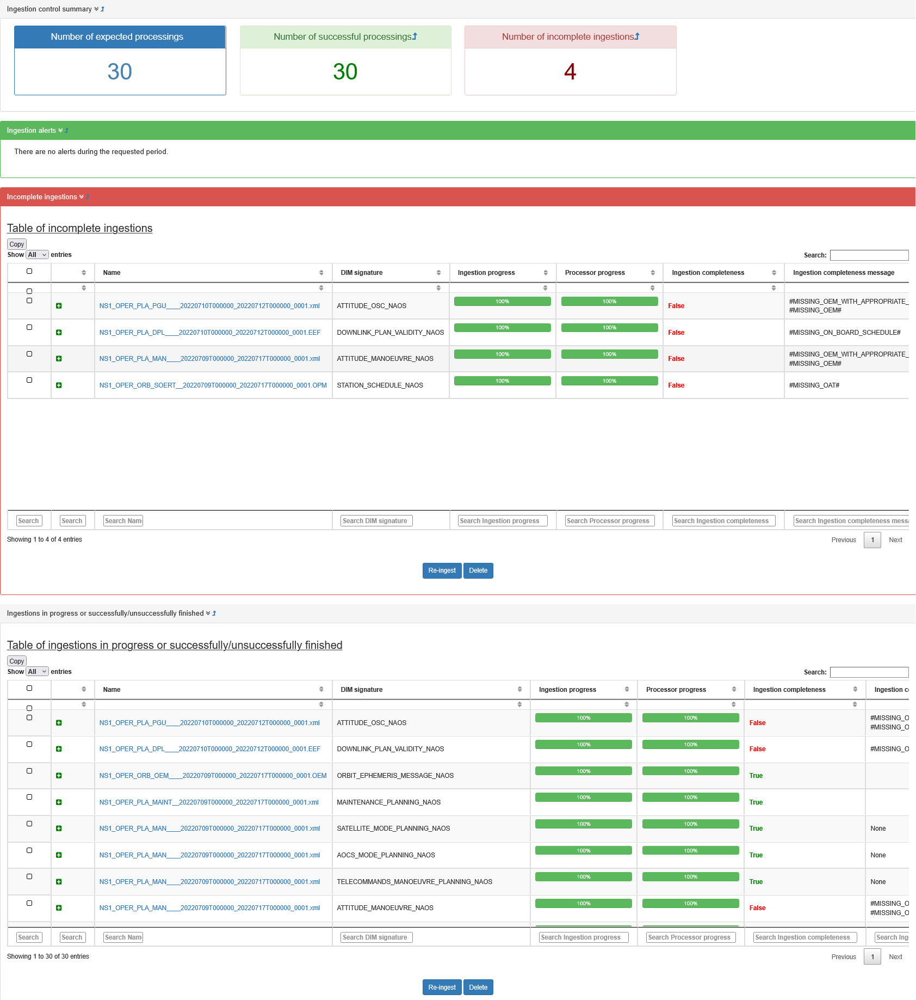
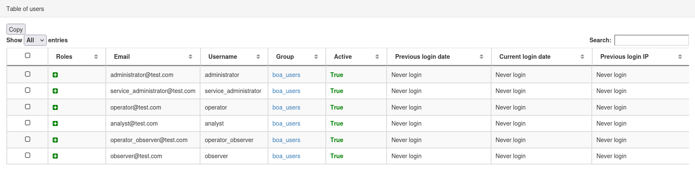

# VBOA: Visualization for Business Operation Analysis

## Overview

VBOA (Visualization for Business Operation Analysis) is a comprehensive web-based data visualization and analysis platform designed to provide real-time monitoring, querying, and visualization of operational data from the BOA (Business Operation Analysis) suite. It serves as the primary UI layer for the entire BOA ecosystem, enabling analysts and operators to explore events, manage reports, monitor system health, and configure business operations workflows. Check [EBOA](https://github.com/danielbrosnan/eboa) for more information.

## Core Features

- **Event Querying & Navigation**: Query and visualize events from EBOA with advanced filtering (temporal, spatial, property-based)



- **Geospatial Visualization**: 3D orbit tracking and satellite visualization using Cesium.js; interactive mapping with OpenLayers





- **Reporting & Analytics**: Integration with RBOA for comprehensive report generation and management





- **System Health Monitoring**: Real-time BOA system health dashboard and monitoring



- **Task Scheduling**: Visualization and simulation of scheduled tasks via SBOA integration



- **Alert Management**: General alerts system with severity filtering and annotations



- **Data Ingestion Control**: Manage and monitor data ingestion from various sources



- **User Management**: Role-based access control with administrator and operator-level permissions



- **REST API**: Programmatic query interface for external integrations
- **Prometheus Metrics**: Metrics endpoint for system monitoring and observability

## Architecture Overview

### Back-end Stack

The back-end is entirely written in [Python](https://www.python.org/) (3.0+) and built on the [Flask](http://flask.pocoo.org/) micro-framework with the following key technologies:

- **Web Framework**: Built with Flask with modular blueprints
- **Security**: Built with [Flask-Security-Too](https://flask-security-too.readthedocs.io/) with password hashing
- **Session Management**: Based on UBOA component from [EBOA](https://github.com/danielbrosnan/eboa) suite
- **WSGI Server**: Based on [Gunicorn](https://gunicorn.org/) and providing SSL capabilities out of the box
- **Data Access**: Direct integration with EBOA, RBOA, SBOA, and UBOA databases

### Front-end Stack

The front-end is built using modern web technologies:

- **Template Engine**: Based on [Jinja2](https://en.wikipedia.org/wiki/Jinja_(template_engine)) and Bootstrap CSS framework
- **HTML/CSS/JavaScript**: Web contents served via ES2015+ JavaScript transpiled via Babel
- **Bundler**: Based on [Webpack](https://webpack.js.org/) and npm package management
- **Visualization Libraries**:
  - **Cesium.js** - 3D geospatial visualization and orbit tracking
  - **OpenLayers** - Interactive web mapping
  - **Chart.js** - Responsive data visualization charts
  - **vis.js** - Network graph and timeline visualization
  - **jQuery** - DOM manipulation and AJAX communication
  - **DataTables** - Advanced table sorting, filtering, and pagination
- **UI Components**: Custom datetime pickers, range sliders, notification system, modal dialogs
- **Production Server**: Based on [Gunicorn](https://gunicorn.org/)

## Core Modules

### Application Layer (`src/vboa/`)

1. **Application Factory** (`__init__.py`)
   - Flask app initialization and configuration
   - Blueprint registration
   - Flask-Security setup with email/username authentication
   - Error handling (404, 403, 405, 500)
   - Session security configuration (HTTP-only, secure cookies in production)

2. **Panel Module** (`panel.py`)
   - Main dashboard entry point (`GET /`)
   - Role-based access control for dashboard views
   - Supports roles: administrator, operator, analyst, operator_observer, observer

3. **Security Module** (`security.py`)
   - Custom authentication decorator: `@auth_required()`
   - Role-based authorization decorator: `@roles_accepted(*roles)`
   - Test-mode support for disabling authentication (`VBOA_TEST=TRUE`)

4. **Query Module** (`query/query.py`)
   - REST API endpoint: `GET /query/`
   - Accepts JSON payloads with event filtering parameters
   - Returns filtered events with Event Records (ERs) and annotations
   - Standardized JSON response format with status codes and error messages

5. **Metrics Module** (`metrics/metrics.py`)
   - Prometheus-compatible metrics endpoint: `GET /metrics/`
   - Reads from `/metrics/metrics_to_publish.txt`
   - Publishes system metrics for monitoring and observability

6. **Service Management** (`service_management.py`)
   - API for controlling BOA service operations
   - Health checks and service status queries

7. **Screenshots** (`screenshots.py`)
   - Capture and save report visualizations
   - Screenshot management for documentation and sharing

8. **User Profile** (`user_profile.py`)
   - Personal user settings management
   - Password change functionality

### View Modules (`src/vboa/views/`)

1. **EBOA Navigation** (`eboa_nav/`)
   - Event querying with advanced filtering (geometry, temporal, properties)
   - Event pagination and pagination support
   - Event alerts browsing and management
   - Geometry visualization (WKT format) on interactive maps
   - Event details and annotations display

2. **RBOA Navigation** (`rboa_nav/`)
   - Reporting system integration
   - Report generation and retrieval
   - Report visualization and export

3. **BOA Scheduler** (`boa_scheduler/`)
   - Task scheduling interface
   - Simulation of scheduled operations
   - SBOA system integration

4. **BOA Health** (`boa_health/`)
   - System health monitoring dashboard
   - Performance metrics and status indicators
   - Service availability tracking

5. **Ingestion Control** (`ingestion_control/`)
   - Data ingestion management and monitoring
   - Ingestion pipeline status
   - Error tracking and reporting

6. **Reporting Control** (`reporting_control/`)
   - Report management interface
   - Scheduled report configuration
   - Report delivery tracking

7. **General View Alerts** (`general_view_alerts/`)
   - Alert system overview
   - Alert filtering by severity
   - Alert annotation and resolution tracking

8. **Earth Observation** (`earth_observation/`)
   - 3D satellite and orbit visualization
   - Orbital mechanics visualization
   - Satellite footprint display

9. **Users Management** (`users_management/`)
   - Administrator user and role management
   - User account creation/modification
   - Role assignment and permission configuration

10. **User Profile** (`user_profile/`)
    - Personal profile management
    - Password update functionality
    - User preferences

## Data Integration

VBOA integrates with multiple BOA subsystems:

- **EBOA (Engine for BOA)**:
  - Entities querying and filtering
  - Alert generation and management
  - Orbit and visibility computations
  - Ingestion event tracking

- **RBOA (Reporting for BOA)**:
  - Report storage and retrieval
  - Report scheduling and delivery

- **SBOA (Scheduling for BOA)**:
  - Scheduled task querying
  - Simulation of scheduled operations

- **UBOA (User management for BOA)**:
  - User accounts and authentication
  - Role definitions and permissions
  - User tracking and audit logs

## Frontend Architecture

### Templates (`src/vboa/templates/`)

```
base.html                      # Main layout template with navigation
panel/                         # Dashboard and main UI pages
eboa_nav/                      # Event navigation interface
rboa_nav/                      # Reporting interface
earth_observation/             # 3D visualization pages
boa_scheduler/                 # Scheduling interface
ingestion_control/             # Data ingestion UI
boa_health/                    # Health monitoring dashboard
general_view_alerts/           # Alert management interface
reporting_control/             # Report management UI
graphs/                        # Chart and graph components
security/                      # Authentication pages (login, registration)
user_profile/                  # User settings pages
users_management/              # Admin user management interface
```

### Static Assets (`src/vboa/static/`)

- **JavaScript** (`js/vboa.js`): Main bundled application (transpiled ES2015+)
- **CSS** (`css/`): Stylesheets (login.css and theme files)
- **Images** (`images/`): UI graphics and icons
- **Distribution** (`dist/`): Webpack output (bundle.js + styles.css)

### Build Configuration (`webpack.config.js`)

- **Entry Point**: `js/vboa.js`
- **Output**: `dist/bundle.js` + `dist/styles.css`
- **Babel Transpilation**: ES2015+ → browser-compatible JavaScript
- **CSS Extraction**: Separate CSS file for optimized loading
- **Asset Handling**: File-loader for images, fonts, vectorelements
- **jQuery Injection**: Global $ and jQuery via ProvidePlugin

## Configuration & Environment

### Environment Variables

- `VBOA_TEST` (TRUE/FALSE): Disables authentication/authorization for testing
- `VBOA_DEBUG` (TRUE/FALSE): Enables Flask debug toolbar and debug mode
- `VBOA_SECRET_KEY`: Path to secret key file (default: `{resources_path}/web_server_secret_key.txt`)

### Security Configuration

- **Secret Key**: Auto-generated or loaded from file
- **Session Cookies**:
  - HTTP-only (XSS protection)
  - Secure (HTTPS only in production)
  - Remember-me persistence support
- **Password Policy**:
  - Password changeability enabled
  - Bcrypt/Argon2 hashing
  - No automatic password change emails
- **Authentication Methods**:
  - Email-based login (case-insensitive)
  - Username-based login
  - Remember-me token persistence

### Role-Based Access Control (RBAC)

Supported user roles:
- `administrator` - Full system access
- `service_administrator` - Service management access
- `operator` - Operational tasks
- `analyst` - Data analysis and reporting
- `operator_observer` - Read-only operator view
- `observer` - Read-only general access

## Deployment

### Docker & Container Support

- **Base Image**: Rocky Linux 9
- **Container Technologies**: Docker, Podman support
- **Dockerfile Variants**:
  - `Dockerfile` - Production build
  - `Dockerfile.dev` - Development environment
  - `Dockerfile.build.boa` - BOA package builder
  - `Dockerfile.github.dev` - GitHub development image

### Docker Compose

- `deploy-compose.yaml` - Production deployment
- `compose_tboa_dev.yml` - Test BOA development environment
- `compose_github_dev.yml` - GitHub CI/CD environment

### Initialization & Setup Scripts

- `build_docker_environment.sh` - Docker environment setup
- `build_podman_environment.sh` - Podman environment setup
- `init_docker_dev_environment.sh` - Development environment initialization
- `create_boa_instance.sh` - BOA instance creation
- `generate_boa_packages.sh` - Package generation
- `generate_docker_image_from_pkgs.sh` - Image generation from packages
- `scripts/start_flask.sh` - Development Flask server
- `scripts/start_flask_compose.sh` - Compose-based Flask launch
